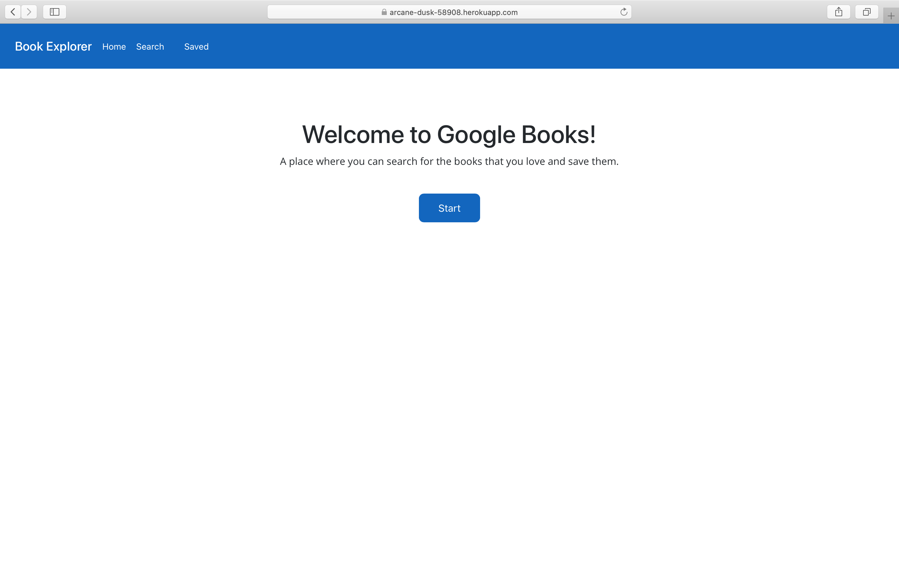
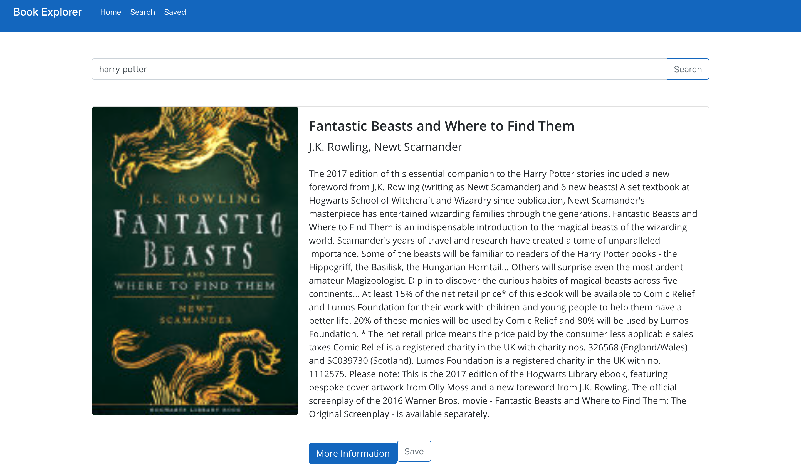

# Google Books Search

## Project Description:
Created an app where users can search for books from the Google Books API and save each book, as well. 

## Installation:
* Express
* MongoDB
* React
* Node

## Usage:
The user will be presented with a search bar and then he or she can search for books. The information the user gets would be a title, author(s), short description, image, and a link to the actual book on Google Books.

## Project Preview
The app looks like the image below

## Project Link:
https://arcane-dusk-58908.herokuapp.com
